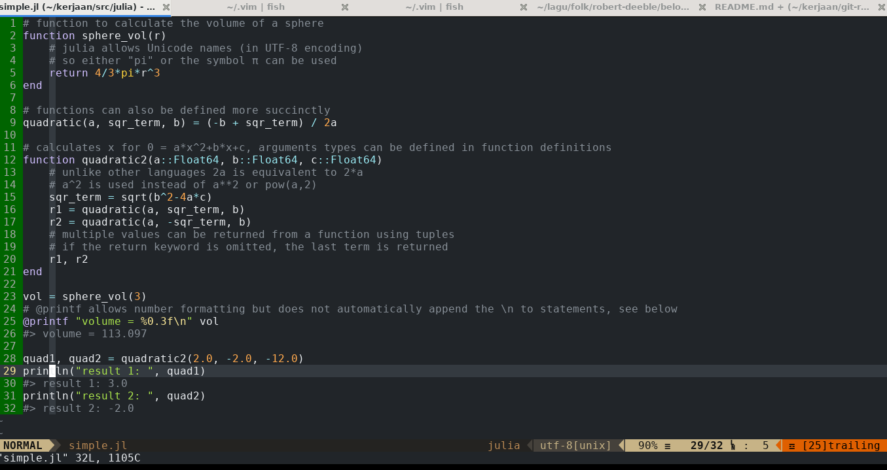

# My **vimrc**

This is my $HOME/.vim/vimrc file. The contents of `$HOME/.vim` file is:

```bash
.
├── pack
│   └── default
│       └── start
│           ├── nerdtree
│           ├── nerdtree-git-plugin
│           ├── vim-open-color
│           └── vim-polyglot
└── vimrc
```

**Note** that I use `packages` directory (default since Vim 8.0 - see `:help packages`. I don't need
lots of plugins (only 4). `Nerdtree` can be activated with **F4** key.

Here's the screenshot, editing Julia source code:


